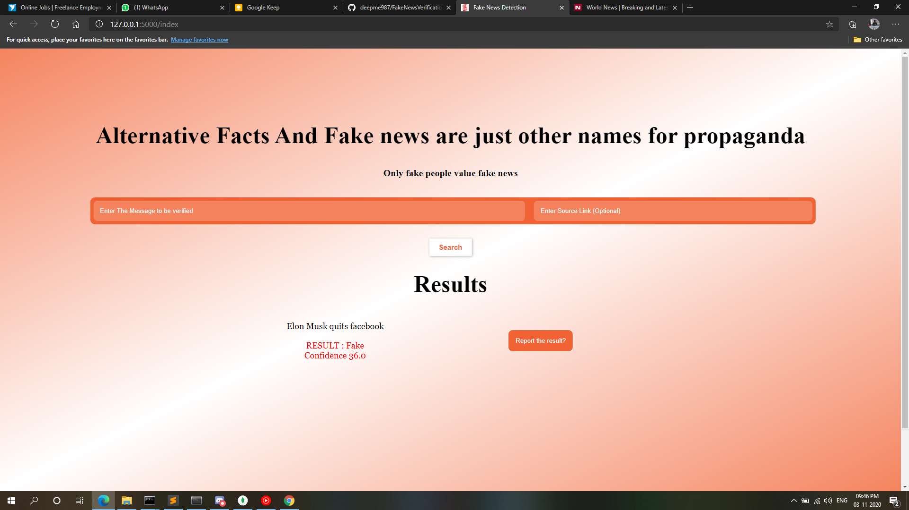

# FakeNewsVerification
---

Fake News Verification is a simple tool that can be used to quickly check a news for it's legitimacy. FakeNewsVerification uses a straight-forward approach to achieve this goal. In layman's terms: it automated the job of having to google search for a particular news to verify it. The application does the same. Given an input of text, we query google with and process the text using NLP. After fetching results, we validate the news and provide a score to the news using our secret scorer. Since the results are queried in real-time, we do not need to update the algorithm or server. The approach we used enables us to provide dynamic results. The application also provides you the confidence of the news. So incase a news is controversial, the lower score will indicate that you may require to look up the news yourself :)

Sample images:
1. Real News:

 
2. Fake News:

*To use the application, you can visit the the the [link]("To be added")*
---

### To run the application on your machine:

1. Clone the repository: `git clone https://github.com/deepme987/FakeNewsVerification.git`
2. Install requirements: `pip install -r requirements.txt`
3. Run `python app.py`
---

*You are free to integrate the code in your application. 
However, if you're resharing your application, I would appreciate if you link the repository and provide credits :)*
